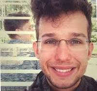

# Mathias Oster

## Junior Professor of Mathematics

Welcome to my academic website. I am a Junior Professor at RWTH Aachen University, where I conduct research at the intersection of [your research areas].

{ width="250" align=right }

## About Me

I am passionate about advancing mathematical research and mentoring the next generation of mathematicians. My work focuses on [specific mathematical domains], with applications in [application areas].

At RWTH Aachen University, one of Europe's leading technical universities, I lead a research group dedicated to exploring fundamental questions in mathematics while fostering collaboration with both theoretical and applied researchers.

## Research Interests

- [Research Area 1]
- [Research Area 2]
- [Research Area 3]
- [Research Area 4]

## News & Updates

!!! note "Recent Highlights"
    - **[Date]**: [Achievement or announcement]
    - **[Date]**: [Achievement or announcement]
    - **[Date]**: [Achievement or announcement]

## Teaching

I am committed to excellence in teaching and regularly offer courses in:

- [Course 1]
- [Course 2]
- [Course 3]

For current course information and materials, please refer to the [RWTH teaching portal](https://www.rwth-aachen.de).

---

*Feel free to explore my [publications](publications.md), [CV](cv.md), and [research collaborations](cooperations.md), or [get in touch](contact.md) to discuss potential collaborations.*
